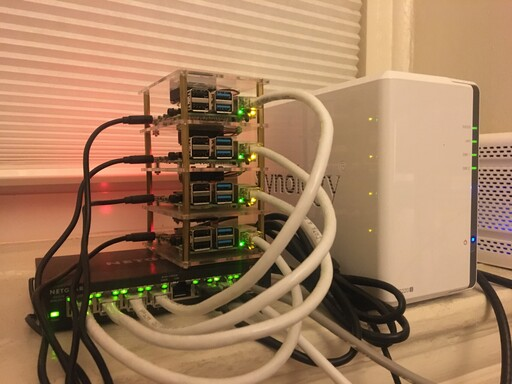

# k8s-ansible-rpi - Ansible playbook for Raspberry Pi Kubernetes clusters



k8s-ansible-rpi is an [Ansible playbook](https://docs.ansible.com/ansible/latest/user_guide/playbooks_intro.html)
designed to (mostly) provision Raspberry Pi Kubernetes clusters.

This is a personal project, made open source in hopes that it might be useful to
some.

## Motivation

While Kubernetes distributions such as [k3s](https://k3s.io/) and
[microk8s](https://microk8s.io/) exist that target the Raspberry Pi as a
deployment environment, at the time this project was conceived (late 2020) they
all lacked IPv6 support. k8s-ansible-rpi attempts to rectify that by
provisioning a full-fledged Kubernetes cluster on Raspberry Pi nodes.

## Overview

k8s-ansible-rpi can be run using a command like the following:

```bash
ansible-playbook site.yml -i inventory/my-cluster/hosts.ini
```

Following a run of the playbook, k8s-ansible-rpi creates a cluster that
includes:
* [containerd](https://containerd.io/)
* Support for [dual-stack networking](https://kubernetes.io/docs/concepts/services-networking/dual-stack/)
* Support for NFS and iSCSI storage

Clusters are provisioned using
[kubeadm](https://kubernetes.io/docs/reference/setup-tools/kubeadm/).

The following features are currently not included in k8s-ansible-rpi:
* Worker node joining to clusters (you have to do this yourself)
* CNI configuration
* Node deprovisioning

## Configuration

k8s-ansible-rpi, like other Ansible playbooks, can be configured using a given
host
[inventory](https://docs.ansible.com/ansible/latest/user_guide/intro_inventory.html). An
example inventory is available in the [examples](examples) directory.

Hosts are arranged into the following groups:
| Name          | Description                                 |
|---------------|---------------------------------------------|
| `k8s_cluster` | Used for all nodes in the cluster           |
| `master`      | Used for control plane nodes in the cluster |

The following variables are used to configure cluster provisioning:
| Name                     | Description                                                                                                                                               |
|--------------------------|-----------------------------------------------------------------------------------------------------------------------------------------------------------|
| `pod_subnet`             | The Pod subnets to use                                                                                                                                    |
| `service_subnet`         | The Service subnets to use                                                                                                                                |
| `node_cidr_mask_size_v4` | IPv4 Node CIDR mask size, passed to [kube-controller-manager](https://kubernetes.io/docs/reference/command-line-tools-reference/kube-controller-manager/) |
| `node_cidr_mask_size_v6` | IPv6 Node CIDR mask size, passed to [kube-controller-manager](https://kubernetes.io/docs/reference/command-line-tools-reference/kube-controller-manager/) |
| `dns_server`             | The DNS server to point machines at. Maybe it's a [Pi-hole](https://pi-hole.net/)                                                                         |
